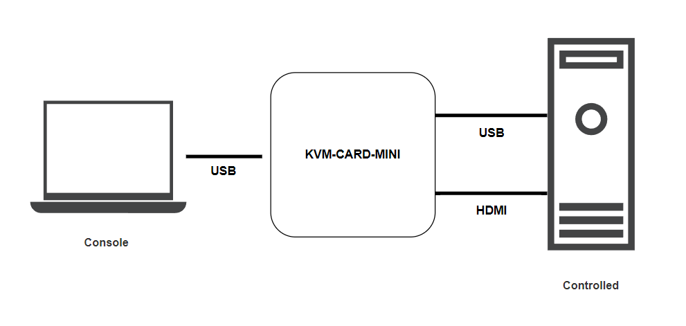
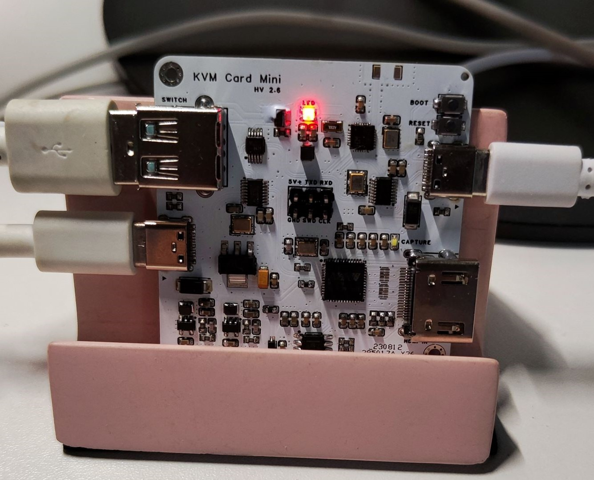

# KVM-Card-Mini

⌨️🖥️🖱️

Simple KVM Console to USB 

A plug-and-play KVM (Keyboard Video Mouse) device control card.

## Features

- HID protocol transmission, driver-free
- Support BIOS keyboard control
- Upper computer program compatible with non-board video capture card
- On-board USB-HUB chip, reduce the number of interfaces
- Single MCU dual USB Device controller, reduce transmission delay
- On-board Bluetooth antenna, debugging interface, can be used for MCU development
- USB device master-slave switching

## Hardware

1. **(Controlling side) USB Host Type-C interface, connect to the host computer **.
2. **(Controlled terminal) USB Host Type-C interface, connect to the controlled terminal, control the keyboard and mouse **.
3. **(Controlled terminal) standard HDMI video input interface, connect to the video output of the controlled terminal** 
4. Bluetooth ceramic antenna (optional installation components)
5. EEPROM support for burning clip burning
6. CH582F debugging interface, only supports WCH-Link (optional components)
7. CH582F 
8. MS2109
9. CH582F Reset Button
10. CH582F USB Burn Select Button
11. WS2812B (optional component installation)
12. SL2.1s
13. ESD protection (optional installation of components)

## 上位机（控制端）

- Realization of screen display, support for device selection, switching output resolution
- Keyboard control of the accused side, support for custom shortcuts, optimize the logic of keyboard function.
- Mouse control on the controlled side, optimize the logic of mouse capture function.
- Keyboard indicator display
- Reset MCU and reset HID connection function.
- Batch text input
- All keys are conflict-free
- Screenshot

## Firmware flashing

### CH582

Press and hold the BOOT key while connecting to the computer with the USB cable, and then use [WCHISPTool](https://www.wch.cn/downloads/WCHISPTool_Setup_exe.html) to flash the firmware.

If you do not use the debugging interface, you do not need to turn on the two-wire emulation interface, i.e., step 6

### MS2109

The matching AT24C16 EEPROM is burned with an EEPROM programmer.
You can use a burn-in clip to burn in the power-down state of the board.

The firmware for the MS2109 is from the [Yuzuki HCC HDMI](https://oshwhub.com/gloomyghost/yuzuki-hcc) project, and changes to the device name can be realized by editing the firmware with the HEX file editor.

## Sample

HV2.0

*JCB color silkscreen version

HV2.6

Add USB switching port

## Thanks

https://oshwhub.com/gloomyghost/yuzuki-hcc

https://materialdesignicons.com/icon/

https://www.riverbankcomputing.com/software/pyqt/

https://github.com/apmorton/pyhidapi

https://www.mounriver.com/

https://pro.lceda.cn/editor

and other open source or free projects

Thanks to @ElluIFX for making the enhanced client:
https://github.com/ElluIFX/KVM-Card-Mini-PySide6

## [License](https://github.com/Jackadminx/KVM-Card-Mini/blob/main/LICENSE)

The MIT License (MIT)

Copyright (c) 2023-2024 Jancgk