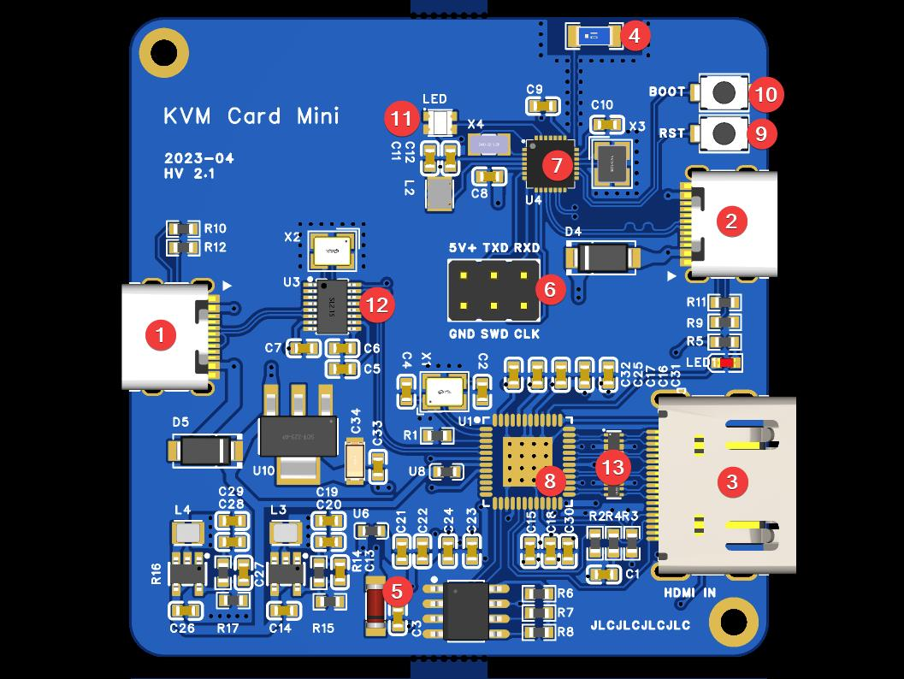
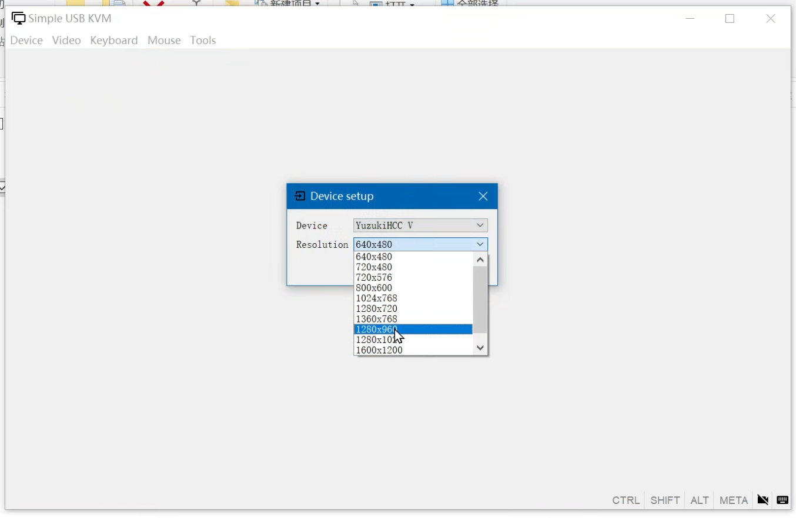
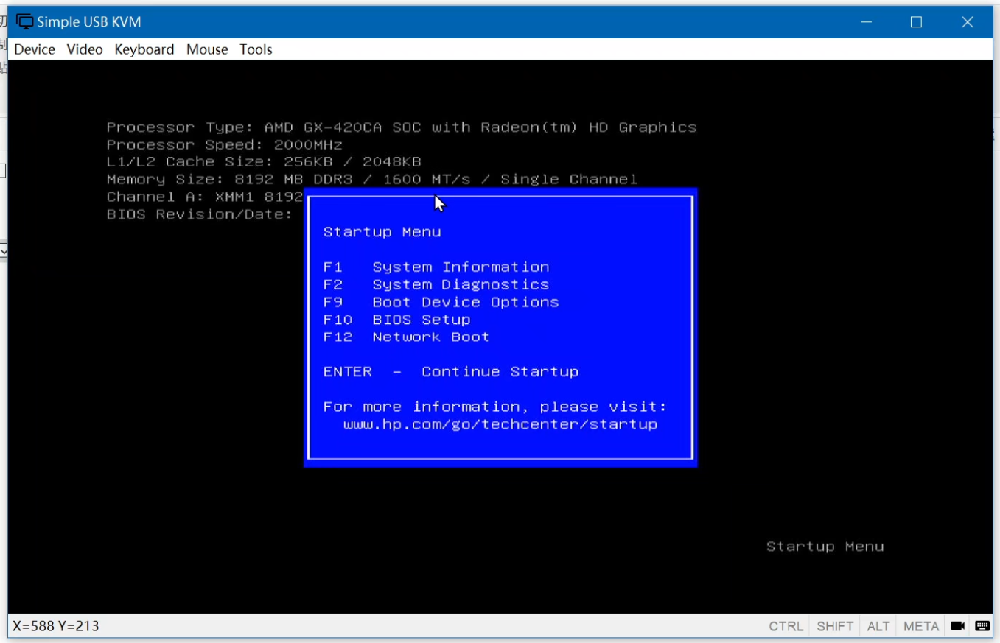
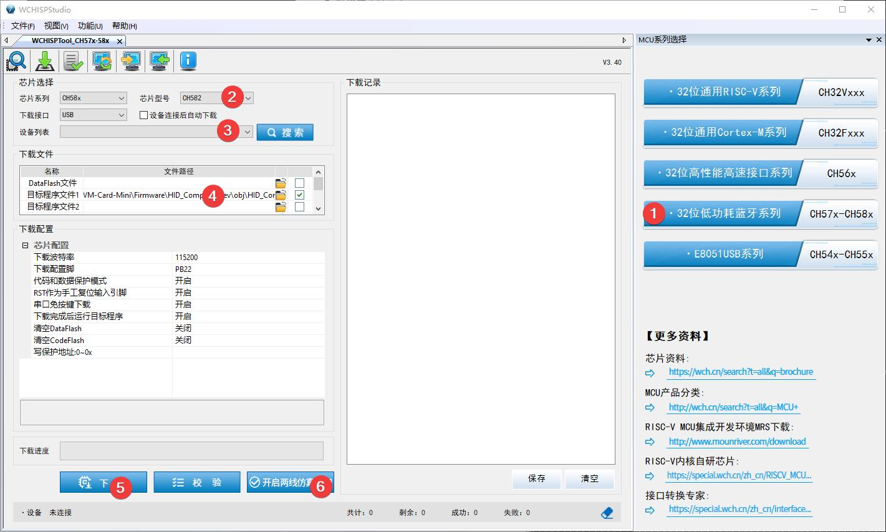
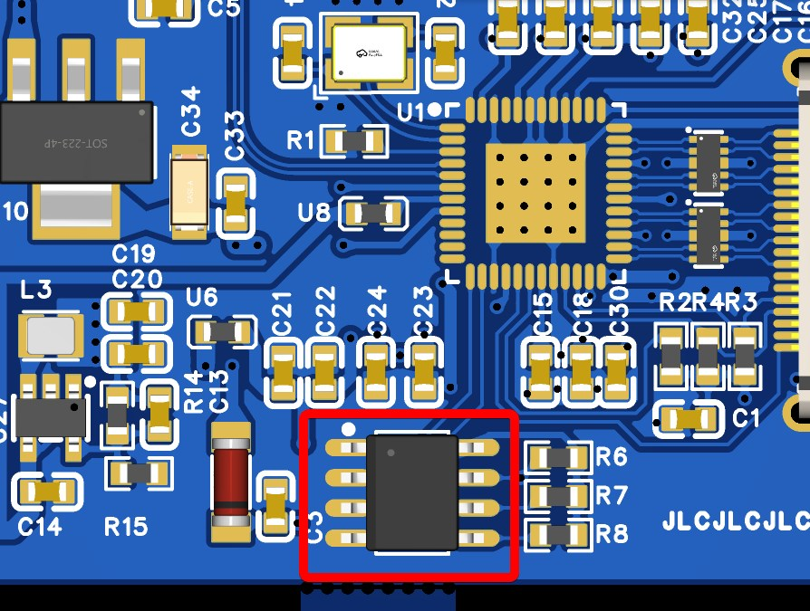
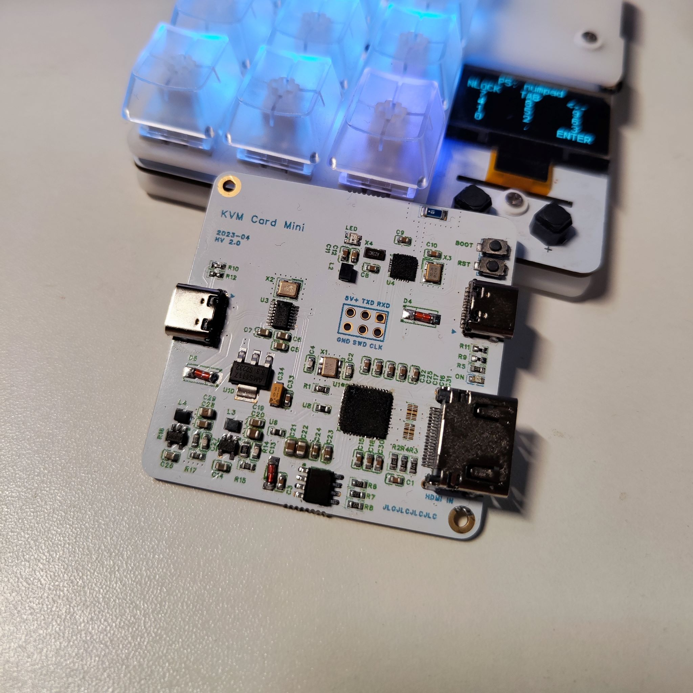

# KVM-Card-Mini

 ⌨️🖥️🖱️ Simple KVM Console to USB 

一个简单的 KVM （Keyboard Video Mouse）功能转接卡，通过上位机程序控制被控设备的屏幕和键鼠

## 功能特点

- HID 协议传输，免驱动
- 支持 BIOS 键盘控制
- 上位机支持其他以摄像头形式的视频采集卡
- 板载 USB-HUB 芯片，减少接口数量
- MCU 集成双 USB 控制器，相比双 MCU 设计更加节省资源并降低传输延迟
- 板载蓝牙天线、调试接口，可用于MCU开发（功能可选）

## 硬件分析

1. **USB Host Type-C 接口，连接至上位机**
2. **USB Host Type-C 接口，连接至被控端，控制键盘鼠标**
3. **标准 HDMI 输入接口**
4. 蓝牙陶瓷天线（能用但不完全能用，没有做阻抗匹配；可选安装元器件）
5. EEPROM 支持烧录夹烧录
6. CH582F 调试接口，只支持 WCH-Link （可选安装元器件）
7. CH582F 
8. MS2109
9. CH582F 重启按钮
10. CH582F USB 烧录选择按钮
11. WS2812B（可选安装元器件）
12. SL2.1s
13. ESD防护（可选安装元器件）

## 上位机（控制端）

- 实现屏幕显示，支持设备选择、切换输出分辨率
- 被控端键盘控制、支持自定义快捷键，优化键盘功能逻辑
- 被控端鼠标控制，优化鼠标捕获功能逻辑
- 键盘指示灯显示
- 重置 MCU 和重置 HID 连接功能

## 固件刷入

### CH582

按住 BOOT 键同时连接至电脑
使用 [WCHISPTool](https://www.wch.cn/downloads/WCHISPTool_Setup_exe.html) 刷入固件

若不使用调试接口，则不需要开启两线仿真接口，即步骤6

### MS2109

配套的AT24C16 EEPROM可以直接买套片，或者用EEPROM编程器烧录。
可以使用烧录夹在板子断电状态进行烧录。

MS2109的固件来自 [Yuzuki HCC HDMI](https://oshwhub.com/gloomyghost/yuzuki-hcc) 项目，可通过HEX文件编辑器编辑固件实现修改设备名。

## 实物图

*嘉立创彩色丝印版本

## 感谢

https://oshwhub.com/gloomyghost/yuzuki-hcc

https://materialdesignicons.com/icon/

https://www.riverbankcomputing.com/software/pyqt/

https://github.com/apmorton/pyhidapi

https://www.mounriver.com/

https://pro.lceda.cn/editor

和其他开源或免费项目

